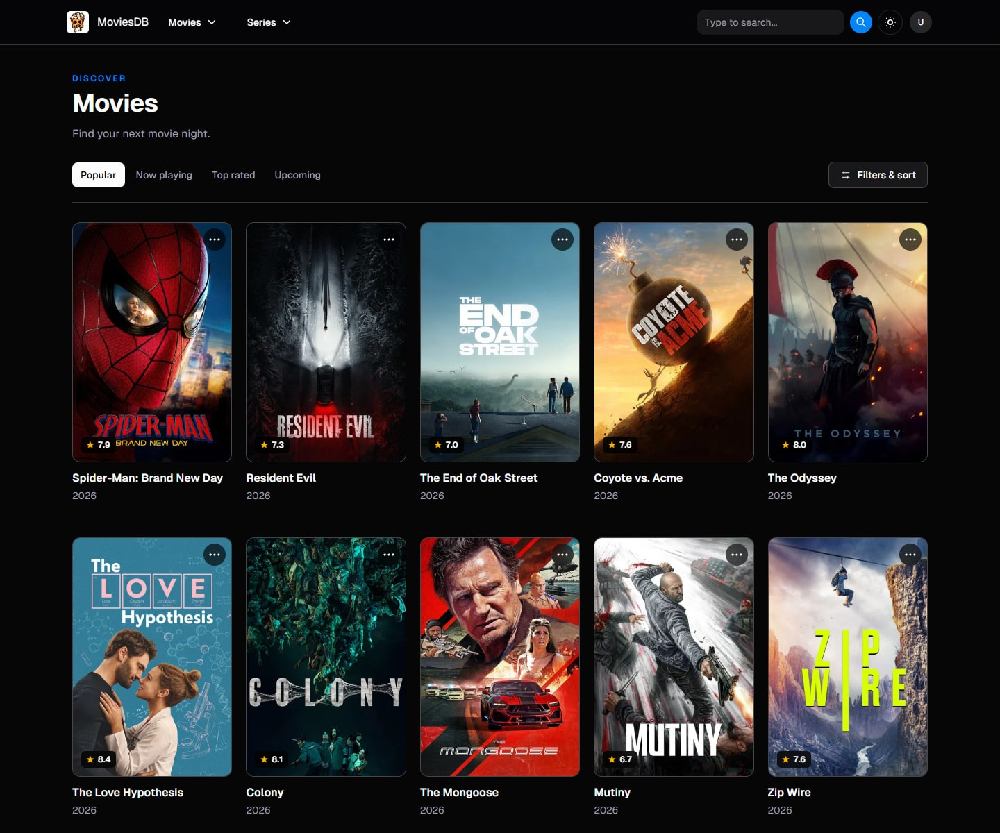

# MoviesDB

Discover movies and TV series, explore cast and crew, watch trailers, and save favorites through a linked TMDB account.



## Features

- Browse trending, popular, top-rated, and upcoming movies, plus series airing today or currently on the air.
- Search movies and series, and refine discovery by genre, streaming provider, language, release date, score, runtime, and keywords.
- Explore movie and series details with trailers, cast and crew, and related recommendations.
- Create an account with Supabase and connect TMDB to manage favorites.
- Switch between light and dark themes, with responsive layouts and keyboard-accessible carousels.

## Built with

- [Next.js](https://nextjs.org) App Router, [React](https://react.dev), and TypeScript, with React Compiler enabled.
- [HeroUI](https://heroui.com) components and toasts, styled with [Tailwind CSS](https://tailwindcss.com).
- [Supabase](https://supabase.com) for authentication and profiles.
- [TMDB](https://www.themoviedb.org) for movie and series data, images, and favorites.
- [SWR](https://swr.vercel.app) for client-side data fetching.
- [Biome](https://biomejs.dev) for linting, formatting, and import organization.
- Deployment on [Vercel](https://vercel.com).

## Local development

Use Node.js 24 and npm, matching the CI environment.

1. Clone the repository and install dependencies:

   ```sh
   git clone https://github.com/aviv-maman/moviesdb.git
   cd moviesdb
   npm ci
   ```

2. Copy `.env.example` to `.env.local` and fill in the following values. Remove the copied `NODE_ENV` entry so Next.js can select the environment for development and production builds.

   | Variable | Value |
   | --- | --- |
   | `NEXT_PUBLIC_SUPABASE_URL` | Your Supabase project URL |
   | `NEXT_PUBLIC_SUPABASE_ANON_KEY` | Your Supabase project's public anon key |
   | `TMDB_API_KEY` | Your TMDB API key |
   | `TMDB_ACCESS_AUTH_TOKEN` | Your TMDB API read access token, without the `Bearer` prefix |

3. Configure Supabase authentication for the local app, including `http://localhost:3000/auth/callback` as an allowed redirect URL.

   Account features also require a `profiles` table matching [lib/database.types.ts](lib/database.types.ts), with a profile record for each user and access policies for that user's record. The SQL files currently checked into [utils/supabase](utils/supabase) are starter `todos` examples; they do not provision the app's profile schema.

4. Start the development server:

   ```sh
   npm run dev
   ```

   Open [localhost:3000](http://localhost:3000). To use favorites, sign in and link your TMDB account from your profile.

## Commands

| Command | Purpose |
| --- | --- |
| `npm run dev` | Start the development server |
| `npm run check` | Check lint rules, formatting, and imports with Biome |
| `npm run lint` | Run Biome lint rules |
| `npm run format` | Format files with Biome |
| `npm run build` | Build the production app and check TypeScript |
| `npm start` | Serve the production build |

Pull requests run Biome checks through GitHub Actions. Run `npm run check` and `npm run build` before submitting changes.

## Data and images

Movie and series information and artwork are provided by TMDB. Trailer videos are embedded from YouTube.
